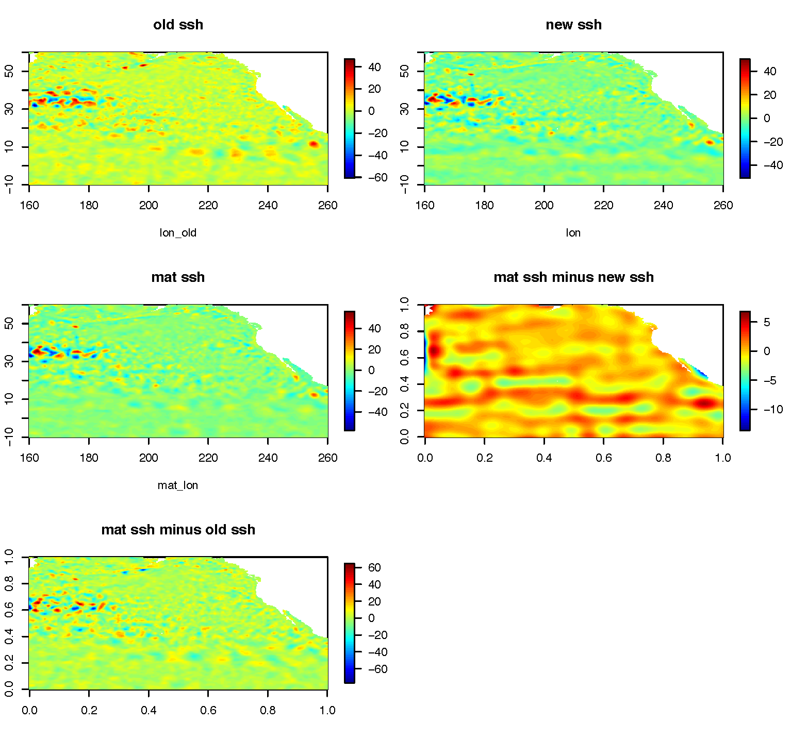

Running some smoother and geostrophic calculation code in matlab as its way faster than anything I can come up with in R, including via various parallelization routines.

Some good instructions [here](https://medium.com/@Arafat./graphical-user-interface-using-vnc-with-amazon-ec2-instances-549d9c0969c5)

```
# [terminal] ssh into running ec2 instance on aws via terminal on mac
ssh -i "amazon.pem" ubuntu@ec2-34-215-224-32.us-west-2.compute.amazonaws.com

# [terminal] setup vnc server via terminal
vncserver
# [terminal] you should be prompted to create a password

# [terminal] close SSH connection
exit


# [terminal] now ssh into running ec2 instance again
ssh -L 5902:localhost:5902 -i amazon.pem ubuntu@ec2-34-215-224-32.us-west-2.compute.amazonaws.com

# [terminal] start vncserver
vncserver -geometry 1340x750

# [chicken] now connect to display-enabled ec2 instance via a vnc client like chicken

host: localhost
port: 2
password: xxx

# [ubuntu CL via chicken] start matlab
matlab ## now matlab gui should prompt you to login and off you go

```

Double check that matlab code folder/files are added to your path.

Full smoother and geostrophic calculations taking ~75 sec per day of data for N hemisphere (-10 to 60 N) on m4.4xlarge. About the same with `smooth2d_loess_par` on m4.16xlarge. Trying a `parfor` loop with standard `smooth2d_loess`.

Outputs look like this:


